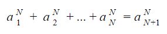
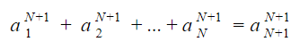
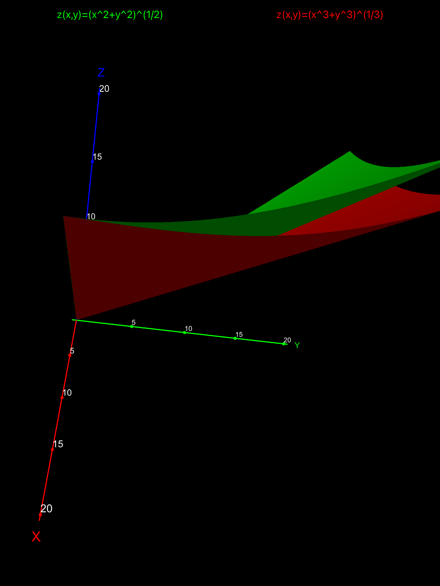

# Lots of numbers. Why?

In the directory called 'results' you can find lists of numbers. See the ReadMe document there about the naming convention. These lists are collected evidences about my recent finding. It's just a suspicion, nothing more. Also, the lists are evidences to support the suspicion, of course they don't prove anything. 

The suspicion is a combination of two statements, a true and a false.

## Positive statement

It is possible to find N natural numbers (a1 to aN), raise them to the power of N and sum these powers, then find another natural number (aN+1), whose Nth power is equal to the sum. So this works:

## Negative statement

You can't do the same with powers of N+1. So this doesn't work:

## That looks familiar

You're right. For the special case of N=2 these are the Pythagorean theorem and Fermat's last theorem (well, with cubes only).

## Where to?

I only have some vague ideas. I like to believe this is about N-dimensional spaces. For N=3 this would be the 3-dimensional Pythagorean theorem and 3-dimensional Fermat's theorem.

If we go back to N=2, so basically the plane, it is something like how far you can stretch the plane (with powers) into the 3rd dimension so that the stretched (transformed) plane would still contain (same) powers of integers in the 3rd dimension.

Same thing but slightly changed for the sake of more compact visualisation: green stretch is root of sum of two squares, red stretch is cube root of sum of two cubes. The green one *does have* integer *z* values where x and y are both integers. The red one *does not*.

## Difficulties

Here are some data about time required for the calculations:
| Dimensions | Cube size | Time needed | Platform |
| ----------- | ----------- | ----------- | ----------- |
| 3 | 20003 | 14 minutes | Core i7 |
| 4 | 15004 | 22 hours | ARM |
| 5 | 10005 | This is currently running, my estimation is about 140-170 days | ARM |

Also, with these numbers and powers I'm already beginning to reach the maximum precision available with built-in data types, so I'll have make changes to the code soon.
